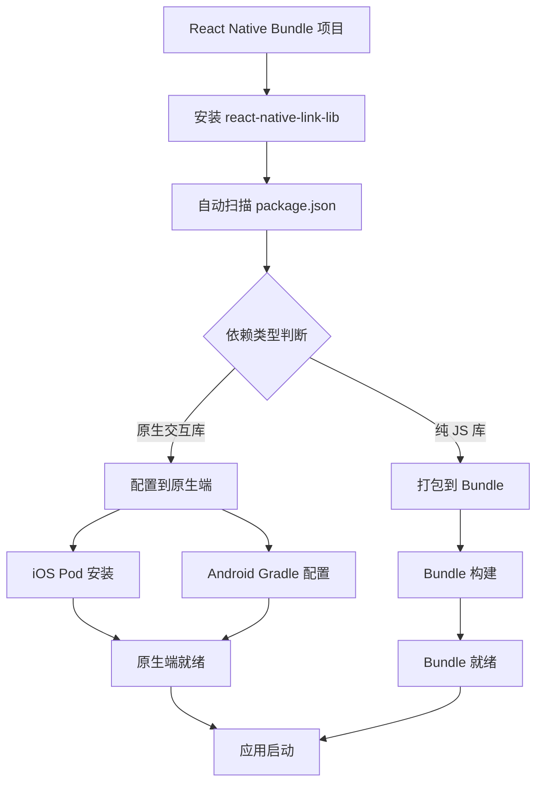

<div align="center">
  <h1>🔗 React Native Link Lib</h1>
  <p>专为 Bundle 模式设计的 React Native 原生依赖管理工具库</p>
  
  [](https://badge.fury.io/js/react-native-link-lib)
  [](https://opensource.org/licenses/MIT)
  [](http://www.typescriptlang.org/)
  [](https://reactnative.dev/)
</div>

## 🎯 项目背景

本库专为 **Bundle 模式** 的 React Native 项目设计。在这种架构下：

- 🏗️ **原生端架构**: 原生应用以 Bundle 的形式直接运行 React Native 代码
- 📦 **依赖分类管理**: 区分纯 JS 库和需要原生交互的三方库
- 🔧 **原生库管理**: 自动管理需要原生交互的三方库的安装和配置
- ⚡ **性能优化**: 纯 JS 库无需在原生侧独立安装，减少包体积

## ✨ 功能特性

- 🚀 **Bundle 模式支持** - 专为 Bundle 架构优化的依赖管理
- 📦 **智能依赖分类** - 自动识别纯 JS 库和原生交互库
- 🔧 **原生库自动配置** - 自动配置 Android 和 iOS 的原生依赖
- 🎯 **TypeScript 支持** - 完整的 TypeScript 类型定义
- 📱 **跨平台** - 同时支持 iOS 和 Android 平台
- 🛡️ **类型安全** - 严格的类型检查，减少运行时错误

## 📋 系统要求

- React Native >= 0.60.0
- iOS >= 11.0
- Android API Level >= 21
- Node.js >= 12.0.0

## 📦 安装

### 使用 npm
```bash
npm install react-native-link-lib
```

### 使用 yarn
```bash
yarn add react-native-link-lib
```

### 使用 pnpm
```bash
pnpm add react-native-link-lib
```

## 📚 文档

项目文档位于 `doc/` 目录下，包含：
- [INSTALLATION_GUIDE.md](doc/INSTALLATION_GUIDE.md) - 详细安装指南
- [README_ANDROID.md](doc/README_ANDROID.md) - Android 平台特殊配置
- [README.md](doc/README.md) - 基础文档pnpm add react-native-link-lib
```

## 🚀 快速开始

### 1. 基础配置

在项目的 `package.json` 中添加依赖：

```json
{
  "dependencies": {
    "react-native-video": "^5.2.1",
    "react-native-link-lib": "^1.0.0"
  }
}
```

### 2. Bundle 模式集成

在 Bundle 模式下，本库会自动处理原生依赖的管理：

```typescript
// 在你的 React Native Bundle 项目中
import 'react-native-link-lib';

// 库会自动检测和配置以下类型的依赖：

// ✅ 需要原生交互的库（会自动配置到原生端）
// - react-native-video
// - react-native-camera
// - react-native-maps
// - react-native-image-picker

// ❌ 纯 JS 库（无需原生配置）
// - lodash
// - moment
// - axios
// - react-navigation
```

### 3. 依赖配置示例

```typescript
// package.json 配置示例
{
  "dependencies": {
    // 需要原生交互的库 - 会被自动配置到原生端
    "react-native-video": "^5.2.1",
    "react-native-camera": "^4.2.1",
    
    // 纯 JS 库 - 仅在 Bundle 中使用
    "lodash": "^4.17.21",
    "axios": "^1.6.0"
  },
  
  // 可选：显式配置原生依赖
  "nativeLibraries": {
    "react-native-video": {
      "platforms": ["ios", "android"],
      "version": "5.2.1"
    }
  }
}
```

## 🔧 平台配置

### Android 配置

本库会自动处理 Android 配置，无需额外设置：

- ✅ 自动添加所需的 Gradle 依赖
- ✅ 自动配置 Android 项目设置
- ✅ 自动包含 react-native-video 依赖
- ✅ 支持 Android API Level 21+

**自动配置的 Gradle 设置：**
```gradle
// 自动添加到 android/build.gradle
minSdkVersion 21
compileSdkVersion 31
targetSdkVersion 31
buildToolsVersion "31.0.0"
```

### iOS 配置

安装库后，在 iOS 目录运行 Pod 安装：

```bash
cd ios && pod install
```

本库会自动处理 iOS 配置：

- ✅ 自动添加所需的 Pod 依赖
- ✅ 自动配置 iOS 项目设置
- ✅ 自动包含 react-native-video 依赖
- ✅ 支持 iOS 11.0+

**自动配置的 Podspec 设置：**
```ruby
# 自动添加到 Podfile
s.dependency "React-Core"
s.dependency "react-native-video", "~> 5.2.1"
s.platforms = { :ios => "11.0" }
```

## 📚 Bundle 模式架构说明

### 🏗️ 架构概述

在 Bundle 模式下，React Native 应用的架构如下：

```
原生应用 (iOS/Android)
├── Bundle 加载器
├── React Native Bundle
│   ├── 纯 JS 库 (打包在 Bundle 中)
│   └── 原生交互库 (需要原生端支持)
└── 原生依赖管理
    ├── react-native-video
    ├── react-native-camera
    └── 其他原生库
```


## 🎯 支持的原生库

### 当前支持的原生交互库

| 库名 | 版本 | 平台 | Bundle 模式 | 状态 |
|------|------|------|-------------|------|
| react-native-video | 5.2.1 | iOS/Android | ✅ 自动配置 | ✅ 完全支持 |

### 即将支持的原生库

- 🔄 **@react-native-async-storage/async-storage** - 本地存储 (v1.23.1)
- 🔄 **@react-native-picker/picker** - 选择器组件 (v2.7.7)
- 🔄 **@react-navigation/native** - 导航库 (v6.1.10)
- 🔄 **@shopify/flash-list** - 高性能列表 (v1.7.3)
- 🔄 **@tencentcloud/chat-react-native** - 腾讯云IM (v0.0.8)
- 🔄 **@tencentcloud/chat-uikit-engine-react-native** - 腾讯云IM UI (v0.0.11)
- 🔄 **react-native-audio-recorder-player** - 音频录制与播放 (v3.6.12)
- 🔄 **react-native-fast-image** - 高性能图片加载 (v8.6.3)
- 🔄 **react-native-fs** - 文件系统访问 (v2.20.0)
- 🔄 **react-native-linear-gradient** - 线性渐变 (v2.8.3)
- 🔄 **react-native-pager-view** - 分页视图 (v6.6.1)
- 🔄 **react-native-safe-area-context** - 安全区域处理 (v4.5.0)
- 🔄 **react-native-screens** - 屏幕导航 (v3.20.0)
- 🔄 **react-native-storage** - 本地存储 (v1.0.1)
- 🔄 **react-native-svg** - SVG支持 (v12.3.0)
- 🔄 **react-native-update** - 热更新 (v10.18.0)
- 🔄 **react-native-video** - 视频播放 (v5.2.1)
- 🔄 **react-native-view-shot** - 视图截图 (v3.8.0)
- 🔄 **react-native-webview** - WebView组件 (v13.10.5)
- 🔄 **react-native-popover-view** - 弹出视图 (v6.1.0)

### 纯 JS 库 (无需配置)

以下库为纯 JavaScript 实现，会自动打包在 Bundle 中：

- ✅ **lodash** - 工具函数库
- ✅ **moment** - 日期处理
- ✅ **axios** - HTTP 客户端
- ✅ **react-navigation** - 导航库
- ✅ **redux** - 状态管理
- ✅ **reselect** - 状态选择器

## 🛠️ 开发指南

### 本地开发

```bash
# 克隆项目
git clone https://github.com/spritekit/react-native-link-lib.git
cd react-native-link-lib

# 安装依赖
npm install

# 类型检查
npm run type-check

# 构建项目
npm run build

# 代码检查
npm run lint
```

### 项目结构

```
react-native-link-lib/
├── android/            # Android 原生配置
│   └── build.gradle   # Gradle 依赖配置
├── ios/               # iOS 原生配置
│   └── RnCommonLib.podspec # Pod 依赖配置
├── index.ts           # 主入口文件
├── package.json       # 包配置和依赖管理
├── tsconfig.json      # TypeScript 配置
└── README.md          # 项目文档
```

### Bundle 模式集成流程



## 🤝 贡献指南

我们欢迎所有形式的贡献！请阅读我们的贡献指南：

### 提交 Issue

- 🐛 **Bug 报告**: 使用 Bug 报告模板
- 💡 **功能请求**: 使用功能请求模板
- 📖 **文档改进**: 直接提交 PR

### 提交 Pull Request

1. Fork 本仓库
2. 创建功能分支: `git checkout -b feature/amazing-feature`
3. 提交更改: `git commit -m 'Add amazing feature'`
4. 推送分支: `git push origin feature/amazing-feature`
5. 提交 Pull Request

### 代码规范

- 使用 TypeScript 编写代码
- 遵循 ESLint 和 Prettier 配置
- 添加适当的测试用例
- 更新相关文档

## 📄 许可证

本项目采用 [MIT 许可证](LICENSE)。

## 🙏 致谢

感谢以下开源项目的支持：

- [React Native](https://reactnative.dev/)
- [TypeScript](https://www.typescriptlang.org/)
