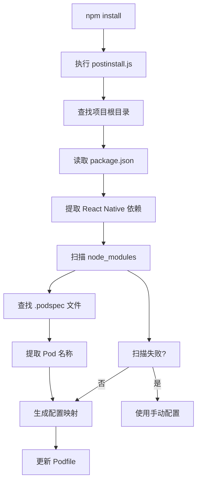

# React Native Link Lib 自动配置系统

## 概述

本项目实现了一个智能的自动配置系统，能够自动扫描项目依赖并生成 Pod 配置，无需手动维护配置文件。

## 功能特性

### 🚀 自动化扫描
- **依赖检测**: 自动从 `package.json` 读取 React Native 相关依赖
- **Podspec 解析**: 智能扫描 `node_modules` 中的 `.podspec` 文件
- **Pod 名称提取**: 从 podspec 文件中自动提取正确的 Pod 名称
- **路径映射**: 自动生成 Pod 名称到包路径的映射关系

### 🛡️ 容错机制
- **回退策略**: 自动扫描失败时回退到手动配置文件
- **错误处理**: 完善的错误处理和日志输出
- **兼容性**: 向后兼容原有的手动配置方式

### 📊 智能过滤
- 只处理 React Native 相关的依赖包
- 支持 `react-native-*` 和 `@react-native-*` 格式的包名
- 自动跳过不存在或无效的依赖包

## 工作流程



## 使用方法

### 自动模式（推荐）

1. **安装依赖**:
   ```bash
   npm install
   ```

2. **自动执行**: 
   - `postinstall` 脚本会自动运行
   - 自动扫描依赖并生成配置
   - 更新 Podfile 文件

### 手动测试

运行测试脚本验证配置生成:
```bash
node scripts/test-auto-config.js
```

### 手动配置（备用）

如果需要手动配置，可以编辑 `podfile-config.json`:
```json
{
  "PodName": "package-name",
  "AnotherPod": "another-package"
}
```

## 配置文件格式

### 自动生成的配置格式
```json
{
  "RNScreens": "react-native-screens",
  "RNSVG": "react-native-svg",
  "RNCAsyncStorage": "@react-native-async-storage/async-storage"
}
```

### Podspec 名称提取规则

脚本支持多种 podspec 文件格式:

1. **标准格式**:
   ```ruby
   s.name = "PodName"
   ```

2. **块格式**:
   ```ruby
   Pod::Spec.new do |s|
     s.name = "PodName"
   end
   ```

3. **其他变体**:
   ```ruby
   spec.name = "PodName"
   name: "PodName"
   name = "PodName"
   ```

## 日志输出

### 成功示例
```
开始自动生成Pod配置...
扫描依赖: /path/to/package.json
扫描模块: /path/to/node_modules
发现Pod配置: RNScreens -> react-native-screens
发现Pod配置: RNSVG -> react-native-svg
生成的配置: { "RNScreens": "react-native-screens", ... }
成功修改Podfile文件
```

### 回退示例
```
自动扫描未找到配置，使用手动配置文件
生成的配置: { ... }
成功修改Podfile文件
```

## 优势对比

| 特性 | 手动配置 | 自动配置 |
|------|----------|----------|
| 维护成本 | 高 | 零 |
| 准确性 | 依赖人工 | 自动保证 |
| 同步性 | 易过时 | 实时同步 |
| 错误率 | 较高 | 极低 |
| 扩展性 | 需手动添加 | 自动发现 |

## 故障排除

### 常见问题

1. **找不到 podspec 文件**
   - 确保依赖包已正确安装
   - 检查 `node_modules` 目录是否存在

2. **Pod 名称提取失败**
   - 检查 podspec 文件格式是否标准
   - 查看日志中的具体错误信息

3. **配置为空**
   - 系统会自动回退到手动配置
   - 检查 `podfile-config.json` 是否存在

### 调试模式

运行测试脚本查看详细信息:
```bash
node scripts/test-auto-config.js
```

## 技术实现

### 核心函数

- `getDependenciesFromPackageJson()`: 提取依赖列表
- `scanPodspecFiles()`: 扫描 podspec 文件
- `autoGenerateConfig()`: 生成自动配置
- `generatePodConfigs()`: 生成 Pod 配置字符串

### 文件结构
```
scripts/
├── postinstall.js          # 主脚本
├── podfile-config.json     # 手动配置（备用）
├── test-auto-config.js     # 测试脚本
└── README.md              # 说明文档
```

## 版本历史

- **v1.0**: 基础手动配置功能
- **v2.0**: 新增自动扫描和配置生成功能
- **v2.1**: 优化错误处理和回退机制

---

**注意**: 此系统设计为零维护成本的解决方案，在大多数情况下无需人工干预。如遇问题，请查看日志输出或使用测试脚本进行诊断。