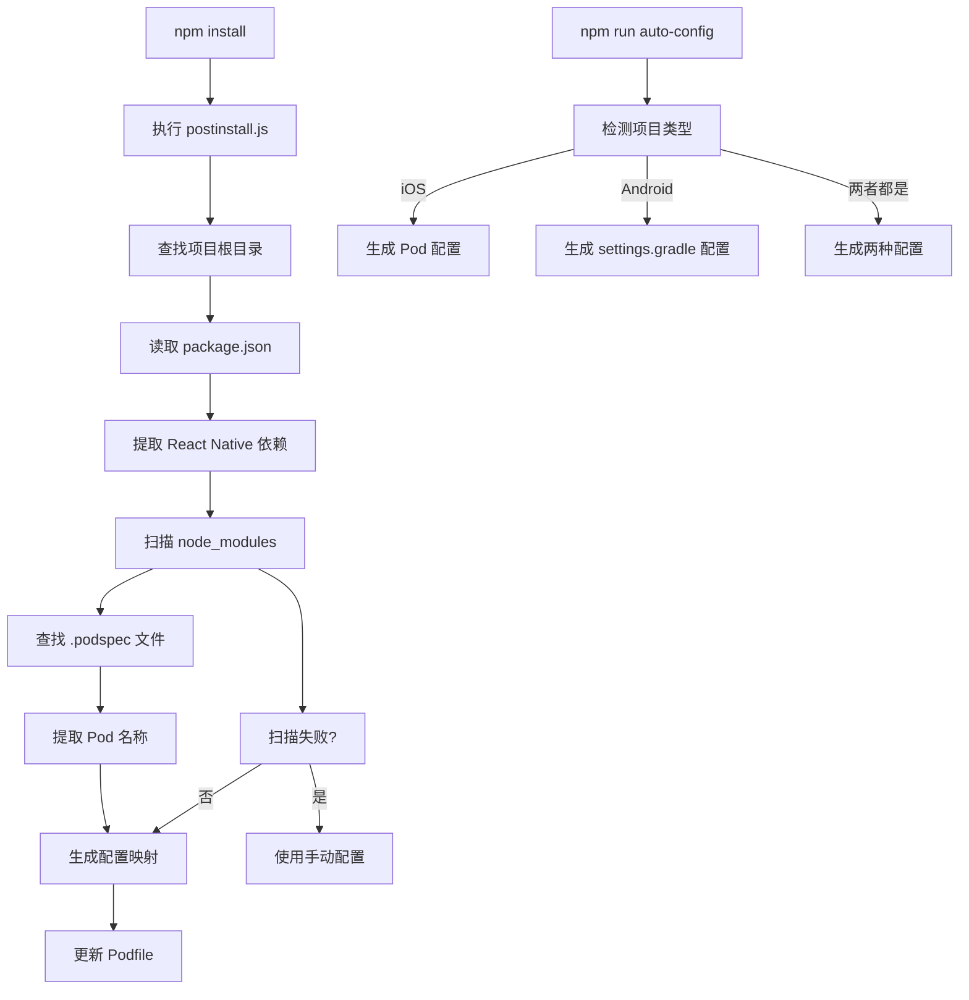

# React Native Link Lib 自动配置系统

## 概述

本项目实现了一个智能的自动配置系统，能够自动扫描项目依赖并生成 Pod 配置和 Android 配置，无需手动维护配置文件。

## 功能特性

### 🚀 自动化扫描
- **依赖检测**: 自动从 `package.json` 读取 React Native 相关依赖
- **Podspec 解析**: 智能扫描 `node_modules` 中的 `.podspec` 文件
- **Pod 名称提取**: 从 podspec 文件中自动提取正确的 Pod 名称
- **路径映射**: 自动生成 Pod 名称到包路径的映射关系
- **Android 配置**: 自动生成 Android 项目的 `settings.gradle` 配置

### 🛡️ 容错机制
- **回退策略**: 自动扫描失败时回退到手动配置文件
- **错误处理**: 完善的错误处理和日志输出
- **兼容性**: 向后兼容原有的手动配置方式

### 📊 智能过滤
- 只处理 React Native 相关的依赖包
- 支持 `react-native-*` 和 `@react-native-*` 格式的包名
- 自动跳过不存在或无效的依赖包

### 🔍 项目类型检测
- **自动检测**: 智能识别当前项目是 iOS 项目、Android 项目或两者都是
- **平台适配**: 根据项目类型自动执行相应的配置生成逻辑

## 工作流程



## 使用方法

### 自动模式（推荐）

1. **安装依赖**:
   ```bash
   npm install
   ```

2. **自动执行**: 
   - `postinstall` 脚本会自动运行 `auto-config.js`
   - 自动检测项目类型并生成相应配置
   - 根据项目类型调用相应的配置脚本

### 智能配置模式

运行智能配置脚本，自动检测项目类型并生成相应配置：

```bash
npm run auto-config
```

该脚本会：
- 自动检测当前项目是 iOS 项目、Android 项目或两者都是
- 根据项目类型生成相应的配置文件
- 对于 iOS 项目，更新 Podfile
- 对于 Android 项目，生成 settings.gradle.generated 文件

### 平台特定配置

如果只需要配置特定平台，可以使用以下命令：

```bash
# 仅配置 iOS
npm run ios-config

# 仅配置 Android
npm run android-config
```

### 手动测试

运行脚本验证配置生成:
```bash
# 智能配置（检测项目类型）
node scripts/auto-config.js

# 仅 iOS 配置
node scripts/podfile-config.js

# 仅 Android 配置
node scripts/gradle-config.js
```

### 手动配置（备用）

如果需要手动配置，可以编辑 `podfile-config.json`，该文件支持两种配置方式：

#### 1. Pod 名称映射表

通过 `podNameMapping` 字段配置 Pod 名称到包名的映射关系：

```json
{
  "podNameMapping": {
    "RNScreens": "react-native-screens",
    "RNSVG": "react-native-svg",
    "RNCAsyncStorage": "@react-native-async-storage/async-storage"
  }
}
```

这个配置用于当自动扫描找到 peerDependencies 时，将包名映射为正确的 Pod 名称。

#### 2. 自定义 Pod 配置

通过 `customPods` 字段配置完全自定义的 Pod 配置：

```json
{
  "customPods": {
    "PodName": "package-name",
    "AnotherPod": "another-package"
  }
}
```

当没有找到 peerDependencies 时，会使用这个配置。

## 配置文件格式

### podfile-config.json

```json
{
  "podNameMapping": {
    "PodName": "package-name"
  },
  "customPods": {
    "PodName": "package-name"
  }
}
```

## 常见问题

### 1. 为什么我的某些依赖没有被自动配置？

可能的原因：
- 依赖包没有 `.podspec` 文件（iOS）
- 依赖包没有 `android` 目录（Android）
- 依赖包名称不符合自动扫描规则（不是以 `react-native-` 或 `@react-native-` 开头）

### 2. 如何处理自定义的 Pod 名称？

如果某个包的 Pod 名称与包名不一致，可以通过 `podfile-config.json` 中的 `podNameMapping` 字段进行映射。

### 3. Android 配置生成后需要手动合并吗？

是的，目前 Android 配置会生成一个 `settings.gradle.generated` 文件，需要手动将其内容合并到项目的 `settings.gradle` 文件中。这是为了避免覆盖用户可能已有的自定义配置。

### 4. 如何选择使用哪个配置脚本？

- **auto-config.js**: 智能检测项目类型并自动选择合适的配置脚本，适用于大多数情况
- **podfile-config.js**: 仅配置 iOS 项目，适用于纯 iOS 项目或需要单独更新 iOS 配置的情况
- **gradle-config.js**: 仅配置 Android 项目，适用于纯 Android 项目或需要单独更新 Android 配置的情况

### 5. 项目类型检测是如何工作的？

项目类型检测基于以下规则：
- 存在 `Podfile` 或 `ios` 目录 → iOS 项目
- 存在 `settings.gradle` 或 `android` 目录 → Android 项目
- 同时满足上述条件 → 混合项目（iOS + Android）
- 都不满足 → 未知项目类型

## 贡献指南

欢迎提交 Pull Request 或 Issue 来改进这个自动配置系统。